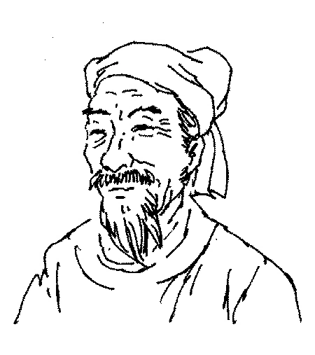

# 测试一级标题
这是一篇测试文章，用来检测我的配置。
## 测试二级标题
### 测试三级标题
#### 测试四级标题

下面测试一些基本的 markdown 语法[^1]：

> **莺啼序**[^2] 【南宋】吴文英[^3]
> 
> 残寒正欺病酒，掩沉香绣户。
> 燕来晚、飞入西城，似说春事迟暮。
> 画船载、清明过却，晴烟冉冉吴宫树。
>念羁情、游荡随风，化为轻絮。
>
>十载西湖，傍柳系马，趁娇尘软雾。
>溯红渐、招入仙溪，锦儿偷寄幽素。
>倚银屏、春宽梦窄，断红湿、歌纨金缕。
>暝堤空，轻把斜阳，总还鸥鹭。
>
>幽兰旋老，杜若还生，水乡尚寄旅。
>别后访、六桥无信，事往花委，
>瘗玉埋香，几番风雨。
>长波妒盼，遥山羞黛，渔灯分影春江宿，
>记当时、短楫桃根渡。青楼仿佛。
>临分败壁题诗，泪墨惨淡尘土。
>
>危亭望极，草色天涯，叹鬓侵半苎。
>暗点检，离痕欢唾，尚染鲛绡，
>亸凤迷归，破鸾慵舞。
>殷勤待写，书中长恨，蓝霞辽海沈过雁，
>漫相思、弹入哀筝柱。
>伤心千里江南，怨曲重招，断魂在否？

[^1]: 来自[百度百科](https://baike.baidu.com/item/%E8%8E%BA%E5%95%BC%E5%BA%8F%C2%B7%E6%AE%8B%E5%AF%92%E6%AD%A3%E6%AC%BA%E7%97%85%E9%85%92/10188638)。
[^2]: *莺啼序*，又名丰乐楼，是吴文英自创的词牌。全篇共240字，是罕见的分为四片的词牌，也是全宋词中最长的词牌。
[^3]: 吴文英（约1205年—约1260年），字君特，号梦窗，晚号觉翁，四明（今浙江宁波鄞州区一带）人，南宋词人。其一生的词作数达340首，于有宋一代仅次于辛弃疾、苏轼以及刘辰翁，收录于梦窗甲、乙、丙、丁四稿之中。其画像可见：

~~不得不说，长得一般~~。

- 测试数学环境:
  定义Riemann zeta函数为:
  $$f(s) = \sum_{i=1}^{\infty}\frac{1}{i^s}$$
  容易得出，它可以解析开拓到整个复平面上。请证明，这个函数的非平凡零点（即除了$s=-2k,k=1,2,...$外的零点）的实部均为0.5。
- 测试代码环境：
  ```c++
  size_t n = arr.size();
  assert(n >= INT_MAX);
  for (int i = 0; i < n; i++) cout << arr[i] << endl;
  ```
- 测试有序列表：
  清代虽然大兴文字狱，但其文化产业却相较之前的朝代更为发达。于词学先后出现过以下流派：
  1. 以朱彝尊为首的浙西词派，此派主张学习姜夔、张炎等人的所谓"清空"、"骚雅"，但大多不得要领，实际读起来往往寡淡无味。
  2. 以张惠言等人为首的常州词派，此派主张学习辛弃疾、王沂孙等人的"比兴寄托"，但大多流于雕琢字句，牵强附会，不知所云。
  3. 至于清末，正所谓国家不幸诗家幸，出现了所谓清末四大家（朱祖谋、况周颐、王鹏运、郑文焯），他们能较好地在前人的基础上发展自己的风格。但由于时代因素，他们的作品总是流露出强烈的黍离之感。

上面提到了清末四大家，下面举出他们的代表作以供观摩，顺便测试表格环境：
|作者|代表作|
|---|---|
|朱祖谋|[声声慢·辛丑十一月十九日味聃赋落叶词见示感和](http://longyusheng.org/ci/zhuxiaozang/4.html)|
|况周颐|[苏武慢·寒夜闻角](http://longyusheng.org/ci/kuangzhouyi/1.html)|
|王鹏运|[浪淘沙·自题《庚子秋词》后](http://longyusheng.org/ci/wangpengyun/14.html)|
|郑文焯|[六丑·芙蓉谢后作](http://longyusheng.org/ci/zhengwenzhuo/11.html)|